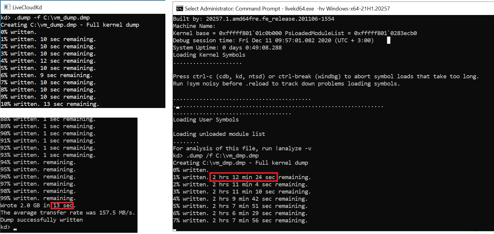

This is fork of LiveCloudKd early developped by Matt Suiche (@msuiche) - https://github.com/comaeio/LiveCloudKd

## LiveCloudKd (2022).

Memory access to full Hyper-V VM memory is stable enough, therefore LiveCloudKd and Hyper-V Virtual Machine plugin for MemProcFS was released as stable version.
https://github.com/gerhart01/LiveCloudKd/releases/download/v2.5.5.20210814/LiveCloudKd.v2.5.5.20220419-release.zip

LiveCloudKd can read and write memory to Hyper-V guest OS using kd.exe from Windows SDK (WDK)

https://github.com/gerhart01/LiveCloudKd/releases/download/v2.5.5.20220419/leechcore_hyperv_plugin_19.04.2022.zip

Methods for accessing guest Hyper-V VM Memory: 

	ReadInterfaceWinHv - uses Hyper-V hypercall for reading guest OS memory. Slow, but robust method; 
	ReadInterfaceHvmmDrvInternal - read data directly from kernel memory. Faster, then ReadInterfaceWinHv, but uses undocument structures). See description of -m option. Default reading method is ReadInterfaceHvmmDrvInternal.
	
	WriteInterfaceWinHv - uses Hyper-V hypercall for writing to guest OS memory.
	WriteInterfaceHvmmDrvInternal - write data directly to kernel memory. Faster, then WriteInterfaceWinHv, but uses undocument structures). See description of -m option. Default writing method is WriteInterfaceHvmmDrvInternal.
	

Tested on Full VM from in Windows Server 2016, Windows Server 2019, Windows Server 2022, Windows 10 and Windows 11

For launch:

1. Place LiveCloudKd.exe, hvlib.dll, hvmm.sys to WinDBG x64 folder (tested on WinDBG from WDK 1809 - 21H2).
2. Launch LiveCloudKd.exe with admin rights (It needs Visual Studio 2022 runtime libraries - https://aka.ms/vs/17/release/vc_redist.x64.exe).
3. Choose virtual machine (Full VM only) for inspection.

LiveCloudKd is more perfomanced, then LiveKd from Sysinternals Suite, at the time of release:

Project uses diStorm3 library (BSD license) by [Gil Dabah](https://twitter.com/_arkon): [Distorm project](https://github.com/gdabah/distorm)
